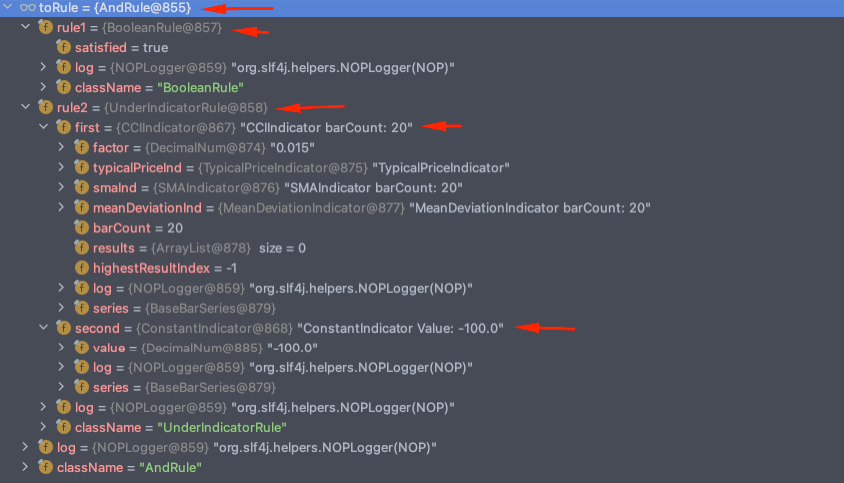

# Ta4j - Strategies Factory

## 1. Description

This library was created to convert a customized json payload into `org.ta4j.core.Rule` object from Ta4j project.

**Example of payload**

``` json
{
    "operator": "AND",
    "rules": [
        {
            "type": "RULE",
            "class": "UnderIndicatorRule",
            "parameters": [
                {
                    "type": "INDICATOR",
                    "class": "CCIIndicator",
                    "parameters": [
                        {
                            "type": "BAR_SERIES"
                        },
                        {
                            "type": "INTEGER",
                            "value": 20
                        }
                    ]
                },
                {
                    "type": "NUMBER",
                    "value": -100
                }
            ]
        },
        {
            "type": "RULE",
            "class": "TimeRangeRule",
            "parameters": [...]
        },
        {
            "type": "RULE",
            "class": "TimeRangeRule",
            "parameters": [...]
        },
        ... and so on
    ]
}
```

**First Rule converted to a `org.ta4j.core.Rule` object (the other rules in the payload above were added only to exemplify)**



## 2. Definitions

### 2.1. Json structure

**Root level**

``` json
Example of payload:

{
    "operator": "AND",
    "rules": [
        ...
    ]
}
```

| Field    | Available Values          |
|----------|---------------------------|
| operator | AND, OR                   |
| rules    | Array of **Rules** object |

---

**Rule object level**

``` json
Example of payload:

{
    "type": "RULE",
    "class": "UnderIndicatorRule",
    "parameters": [ 
         {
            "type": "RULE",
            "class": "UnderIndicatorRule",
            "parameters": [...]
         }
         // OR
         {
            "type": "INDICATOR",
            "class": "CCIIndicator",
            "parameters": [...]
         }
         // OR
         {
            "type": "NUMBER",
            "value": -100
         }
         // OR
         {
            "type": "INTEGER",
            "value": 100
         }
         // and so on
     ]
}
```

| Field      | Available Values                                                                                                                                                      |
|------------|-----------------------------------------------------------------------------------------------------------------------------------------------------------------------|
| type       | RULE                                                                                                                                                                  |
| class      | Full path of [Ta4j Rule classes](https://github.com/ta4j/ta4j/tree/master/ta4j-core/src/main/java/org/ta4j/core/rules). E.g: `org.ta4j.core.rules.UnderIndicatorRule` |
| parameters | Array with the required parameters in the constructors (at the same defined order) from Rule's classes                                                                |

Real example:
- Take a look the `UnderIndicatorRule` class from Ta4j and its respective constructor: [UnderIndicatorRule.java#L54](https://github.com/ta4j/ta4j/blob/8994ecbc9e644f7cfc36216c7de9eef4b65a4b22/ta4j-core/src/main/java/org/ta4j/core/rules/UnderIndicatorRule.java#L54)
``` java
public UnderIndicatorRule(Indicator<Num> indicator, Number threshold) {
    ...
}
```

To create an instance of this class, you should send a Rule object in this way:
``` json
{
    "type": "RULE",
    "class": "UnderIndicatorRule",
    "parameters": [
        {
            "type": "INDICATOR",
            "class": "CCIIndicator",
            "parameters": [
                {
                    "type": "BAR_SERIES"
                },
                {
                    "type": "INTEGER",
                    "value": 20
                }
            ]
        },
        {
            "type": "NUMBER",
            "value": -100
        }
    ]
}
```

---

**Indicator object level**

``` json
Example of payload:

{
    "type": "INDICATOR",
    "class": "CCIIndicator",
    "parameters": [
        {
            "type": "BAR_SERIES"
        },
        // OR
        {
            "type": "INDICATOR",
            "class": "CCIIndicator",
            "parameters": [...]
        }
        // OR
        {
            "type": "NUMBER",
            "value": -100
        }
        // OR
        {
            "type": "INTEGER",
            "value": 100
        }
        // and so on
    ]
}
```

| Field      | Available Values                                                                                                                                                                |
|------------|---------------------------------------------------------------------------------------------------------------------------------------------------------------------------------|
| type       | INDICATOR                                                                                                                                                                       |
| class      | Full path of [Ta4j Indicator classes](https://github.com/ta4j/ta4j/tree/master/ta4j-core/src/main/java/org/ta4j/core/indicators). E.g: `org.ta4j.core.indicators.MACDIndicator` |
| parameters | Array with the required parameters in the constructors (at the same defined order) from Indicator's classes                                                                     |

Real example:
- Take a look the `CCIIndicator` class from Ta4j and its respective constructor: [CCIIndicator.java#L52](https://github.com/ta4j/ta4j/blob/8994ecbc9e644f7cfc36216c7de9eef4b65a4b22/ta4j-core/src/main/java/org/ta4j/core/indicators/CCIIndicator.java#L52)
``` java
public CCIIndicator(BarSeries series, int barCount) {
    ...
}
```

To create an instance of this class, you should send an Indicator object in this way:
``` json
{
    "type": "INDICATOR",
    "class": "CCIIndicator",
    "parameters": [
        {
            "type": "BAR_SERIES"
        },
        {
            "type": "INTEGER",
            "value": 20
        }
    ]
}
```

---

**Available Values references**

| Field    | Class                                                                                                                                                 |
|----------|-------------------------------------------------------------------------------------------------------------------------------------------------------|
| type     | [JsonElementType.java](https://github.com/thiaguimcavalcanti/ta4j-strategies-factory/blob/main/src/main/java/com/tcrade/enums/JsonElementType.java)   |
| operator | [JsonOperatorType.java](https://github.com/thiaguimcavalcanti/ta4j-strategies-factory/blob/main/src/main/java/com/tcrade/enums/JsonOperatorType.java) |

## 3. How to use this library

This library can be used as a dependency in your project. So, you will be able to access all classes parsing your json payload in Ta4j classes as demonstrated previously.

### 3.1. How to parse a json payload into a Rule object

This is the class responsible for: [RuleParser.java](https://github.com/thiaguimcavalcanti/ta4j-strategies-factory/blob/main/src/main/java/com/tcrade/RuleParser.java)

You should initialize that class and call the [parse method](https://github.com/thiaguimcavalcanti/ta4j-strategies-factory/blob/f20a1a53248825adc42c34ee317ccb65bd28f7a1/src/main/java/com/tcrade/RuleParser.java#L27) as demonstrated below:
``` java
String payload = "{\"operator\":\"AND\",\"rules\":[{\"type\":\"RULE\",\"class\":\"UnderIndicatorRule\",\"parameters\":[{\"type\":\"INDICATOR\",\"class\":\"CCIIndicator\",\"parameters\":[{\"type\":\"TIME_SERIES\"},{\"type\":\"INTEGER\",\"value\":20}]},{\"type\":\"NUMBER\",\"value\":-100}]}]}";

// 1. Initialize the class setting the BarSeries filled accordingly
RuleParser parser = new RuleParser(new BaseBarSeries());

// 2. call the parse method to convert the payload into an org.ta4j.core.Rule class
Rule rule = parser.parse(payload);
```

## 4. Customized Rules - Many possibilities

This library provides you to create many Rule's possibilities in a simple way, using JSON structure and with easy integration to your project.

Depending on your implementation, you can store this JSON payload in a database for example, and every time you receive a new ticket, a new call to the RuleParser sending the JSON to convert it into an `org.ta4j.core.Rule` to run your strategy.

## 5. Tools

* [Gradle 7.3.2](https://gradle.org/)
* [Lombok 1.18.22](https://projectlombok.org)
* [Java 17](https://www.java.com/en/download/)
* [ta4j 0.14](https://github.com/ta4j/ta4j)